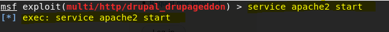
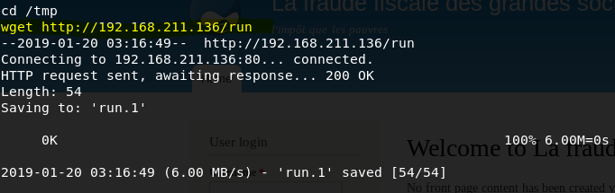

# Drupal - Content Management System
## Method: **Metasploit**
## Student Name: **Pramath Joshi**
## Instructors: **Mr Sayasmito and Mr David Jorm**
## Institution: **Coder Academy Melbourne**
## Aim: To Escalate Privileges and Achieve ROOT Access
## Exploit Name: **Drupalgeddon**

# Background

- Drupal is a content management software and is used to   develop various websites and applications that users     use every day. The tools that are offered with Drupal    assist in making the website versatile and has           structured content that dynamic web experiences need. 

- It is also an excellent choice for creating combined digital frameworks by extending to thousands of          add-ons.

- The projects that are accomplished using the Drupal      software is open source, meaning that anyone can         download, use, work on and share with others.  

- It’s always free 
 
 # Methodology Step By Step:

 1. To establish what network, I am on in Kali Linux, I inserted a command called: ***ifconfig***

 

As you can see from the image, the output is telling me that my systems Internet Protocol (IP) Address that is assigned to me is 192.168.211.132 which is a private network meaning it is restricted to either home or work environments. 

I can also let you know that because of the netmask being 255.255.255.0 I immediately know that I am on the 192.168.211.0 network. The subnet mask being /24 lets me know that. 

2. To view what networks are available around my environment I issued a command called: ***netdiscover -r 192.168.211.0***

 

As you can see from the output, I can see 3 IP addresses and the vendors are all VMware’s. I can see that the IP 192.168.211.1 is my gateway address since it starts with a .1. 

I can see that 192.168.211.254 is the last usable address. I can finally see that the Drupal machine must be on 192.168.211.133 with the above MAC address which is the physical address.

3. THirdly, I issued the command for an NMAP scan which stands for Network Mapping to discover any open ports on that machine by issuing the command: ***NMAP 192.168.211.133***

 

 This is a light-weight scan to quickly observe which port is open. I can see from the report that port 80 is open and it’s on TCP which primarily is a web server running on port 80. I can see that the state is open and the service it’s offering is http which is Hyper Text Transfer Protocol.  

4. Fourthly, I opened Mozilla Firefox in my Virtual Machine and I inserted the Internet Protocol Address of ***192.168.211.133:80*** to see what comes up.

 

 I can see from the output that it is not a secure link to the page since I have put both machines to host only. I can see it asks for a Username and Password. I know that it is the Drupal Content Management software.

 5. Fifthly, I issued a deeper NMAP scan to see what else I could find.

 

 The -Pn parameter treats all hosts as online and skips host discovery.
 
 The -sV parameter is to probe open ports to get the service and version information of the target.

The -A parameter enables Operating System detection, version detection, script scanning and traceroute. 

The -p- parameter lists all ports.

Finally the -v parameter deals with increasing verbosity levels. 

I can immediately see that I am getting the same output as the light weight scan because only one port is open. 

I can see some additional information regarding which server the machine is running on and I can see it runs on Apache version 2.4.7 and runs on the Linux distributing system called Ubuntu. 

I can immediately see that this machine is not secure because it uses MD5 (Message-Digest Algorithm) which is fast but not secure.  

So, I can immediately recognise that this system will have vulnerabilities. 

I can see more information from the deep scan which relates to the files that the machine has included which can be useful for later.

This output is extremely important because it is giving me a report of which version of Linux Drupal is running on. 

I can see it either runs on LINUX VERSION 3.X OR 4.X. 

It is also giving me vital information regarding the Operating System Details which tells me that it uses Linux 3.2 – Linux 4.9. 

I can use these two pieces of information to research more about the system and hopefully find something to get root. 

6. I found out more information about the Operating system online and it gave me information about how I can get to a low privileged shell using the Metasploit framework. I ran the ***msfconsole*** command. 

MSF console loads up and gives me a command prompt.

**Information on Metasploit**

The Metasploit framework itself is a free, open source penetration testing solution that is created by the open source community. 

The use of Metasploit is to basically defend the individual systems by breaking into them and to learn about vulnerabilities that pose a real risk.

MSF console is the most popular interface to the Metasploit Framework, it gives an all in one centralised console and gives us efficient access to all the options in MSF. 

It gives an easy opportunity for penetration testers to use a directory to the exploit found in the machine and set the target to be the machine’s IP and we can load a limited shell. 

So, it Is an extremely powerful console. 

7. I know that the exploit's name was drupal_drupageddon so I used a feature of the msfconsole called searchsploit to search for the path to where the exploit lives. 

I can see that it gives me details of when it was previously disclosed,which was during the year of 2014 and I can also see the path to the exploit code. 

8. I inserted the command ***use: exploit/multi/http/drupal_drupageddon*** which allowed me to select the module by the name.

9. After that I inserted the command: ***show options*** which gave me the following output:

I can see that I have two options which may be of use to me, one is RHOST which means that I can set the host to be Drupal’s IP address and use that to exploit, I can also state the open port which is port 80 and MSF console recognised that its open because I had done a NMAP scan also.

I also have information about the exploit target which gives me information about Drupal technology, and I can see the version number which is from 7.0 – 7.32 I can also do a PHP injection method. 

10. I issued the ***set RHOST 192.168.211.133*** command. 

11. I used the command **exploit** which initiated a reverse TCP handler and established a session with Drupal and I was able to get meterpreter. 

Meterpreter is an advanced, extensible payload that uses in memory DLL injection. Meterpreter uses encrypted communications. I can use this to get a limited shell. 

12. **I WAS ABLE TO GET A LIMITED SHELL WITH THE METERPRETER**

13. I ran the command called: ***uname -a*** to get kernel information about the target machine.

I can see that Linux Droopy is running on Linux Version 3.13.0 

**Next Goal: BREAK OUT OF THE LIMITED SHELL AND ACHIEVE ROOT**

14. I used the commands: **id**, **whoami**, **lsb_release -a to know more information about the system**

The target machine Drupal is running on Ubuntu 14.04 and Kali contains a local version of exploit dB which is a database that contains the exploits, code and publications. 

I can access this information using a tool called SearchSploit by running the searchsploit command. 

15. In step number 13 I was able to view which kernel the Drupal machine was running on and with this information I was able to insert the command to find the exploit that has the local privilege escalation: ***searchsploit Linux 3.13***

The output in the screenshot informs me about the path to the exploit of the local privilege escalation. 

16. I was then able to do a thorough search using the command: ***locate exploits/linux/local/37292.c***

The exploit is written in the C programming language, I know this because it is a C extension and the locate command is used to discover the full path. 

17. I was able to do a **cat /usr/share/exploitdb/exploits/linux/local/37292.c** command on the path and I was able to read the file which is written in C. 

Next step is to transfer the exploit to the target and by researching online I found that the simplest way to achieve this is to host the file on an Apache server on the Kali machine and connect to the server from the target machine and download the file. 

18. I issued the command: **ln -s /usr/share/exploitdb/exploits/linux/local/ /var/www/html/

This command establishes a link between the directory where the exploit is located and the directory that has the files on the server.

19. **Command to start the Apache server:**

20. Ran a command on Kali called ***nano /var/www/html/run***

Creates a run page using the nano editor, apache has one server block enabled by default that is configured to serve documents from the /var/www/html directory. 

21. Ran this command on the nano file:

When this file is executed, it will use netcat to connect to the Kali machine's IP Address on port 4321 and replicate a shell.

WHy port 4321? - Uses TCP and guarantees delivery of data packets on that port in the same order in which they were sent. 

22. I attempted to connect to the target via netcat, but it failed and I realised that I entered the command to create a link between the local directory and the server was wrong and I troubleshooted it myself using Google and discovered that the syntax was mentioned like below:

**Reference:** https://askubuntu.com/questions/543516/what-is-a-failed-to-create-a-symbolic-link-file-exists-error  

23. I was ready to upload files on the target machine but I forgot that I was within the targets shell, instead of issuing the IP address of the Kali machine I issued the IP address of the target machine (Drupal). Hence, I was getting a 404 not found error. 

24. I fixed the error:

I can see that when I did a wget command with Kali machine’s IP address I changed to the tmp directory because I could read and write to it and wget was used to connect to the server running on Kali and transfer the files onto the target machine.  

25. The C file that was executable is now saved onto the server:

26. I was able to compile the C file that had the exploit code and check that the file was transferred successfully.

27. I was able to achieve my goal of escalating privileges and getting root (full privileged access) on the target machine:

**Reference Used:**
https://null-byte.wonderhowto.com/how-to/perform-local-privilege-escalation-using-linux-kernel-exploit-0186317/

