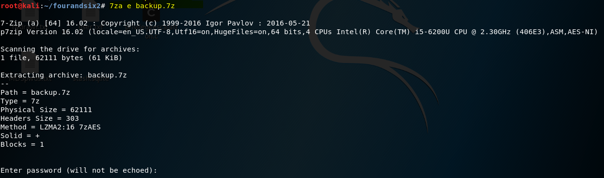
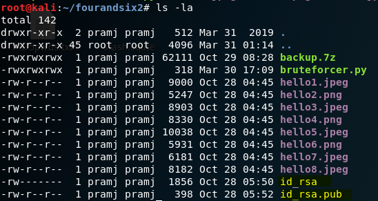
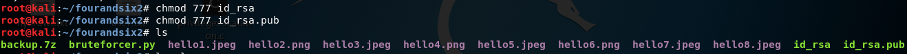

#  Four and Six 
## Method: **Python Script**
## Student Name: **Pramath Joshi**
## Instructors: **Mr Sayasmito and Mr David Jorm**
## Institution: **Coder Academy Melbourne**
## Aim: To Escalate Privileges and Achieve ROOT Access
## Status: **To Be COMPLETED**

# Background

The four and six vulnerable machine has the capability of mounting a disk onto the drive and getting the contents of the disk to the local machine which has files related to images and the public and private key. 

# Methodology Step By Step:

1. A deep NMAP scan revealed that the ports 22 and 111 running the SSH and rpcbind services are up. 

2. showmount -e revealed that the directory located on the target is open for everyone to mount on.

3. Mounted the home/user/storage directory on the remote machine's fourandsix2 folder. 

4. Discovered the zipped backup.7z file 

5. Listed the contents of the backup.7z file using 7z l backup.7z command. 

I can see important information regarding the private and public keys which maybe encrypted.

I cannot unzip it since its password protected, hence using 

6. Found a Python script online that has the capability to crack the backup.7z password.

7. Ran the command below to crack the backup.7z file using rockyou.txt which has the default list for common passwords.

**OUTPUT**

I can see the password in clear text.

8. I ran the command 7za e backup.7z which extracted the backup.7z file

9. When I issued a ls -la command on the terminal I was able to see interesting files which can be of use in the future.

The files I am concerned about is id_rsa which is the client’s private key and the id_rsa.pub which is the client’s public key.

10. Changed the permissions for both the private and public keys because I need to decrypt both. 

