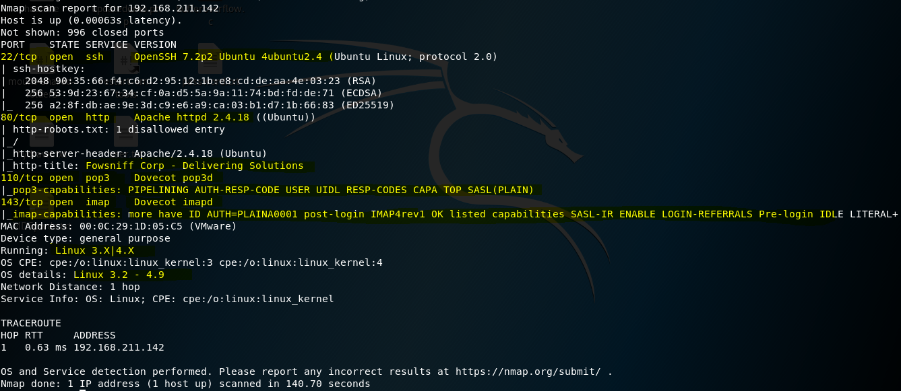
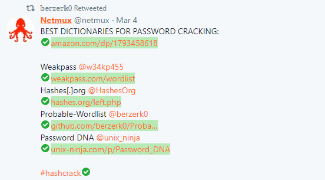
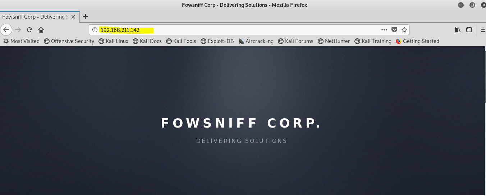
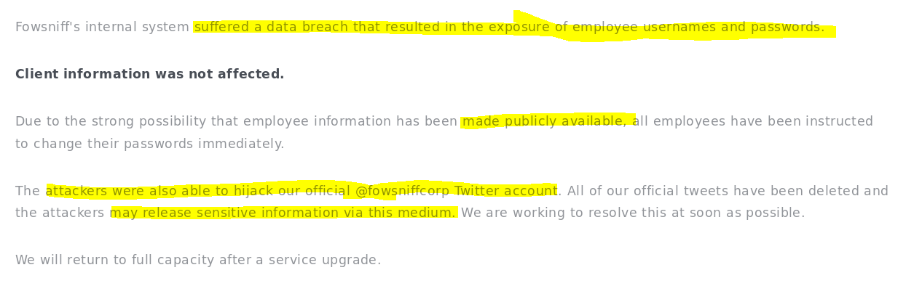
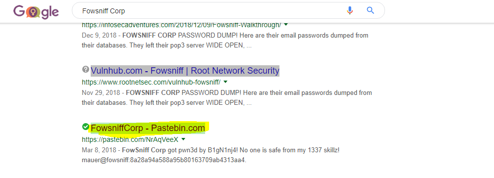
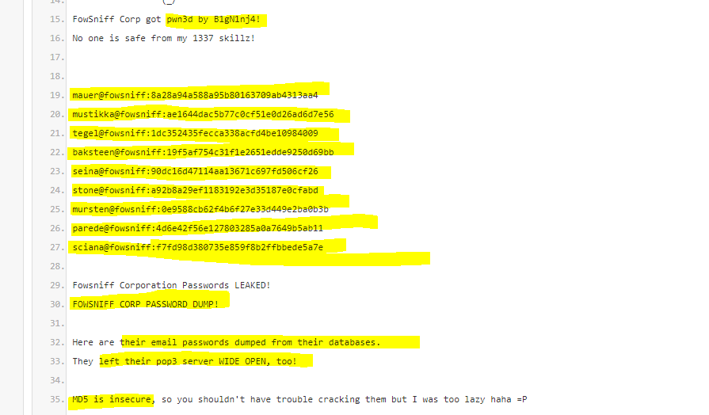

# Drupal - Fowsniff Corporation 
## Method: **Enumeration**
## Student Name: **Pramath Joshi**
## Instructors: **Mr Sayasmito and Mr David Jorm**
## Institution: **Coder Academy Melbourne**
## Aim: To Escalate Privileges and Achieve ROOT Access
## Exploit Name: **Email Server - Dovecot/POP3D**
## Status: **To Be COMPLETED**

# Background

Their website is down and in their home page they have mentioned that they have suffered a data breach which has resulted in their employee usernames and passwords being exposed. 

# Methodology Step By Step:

1. Performed a deep level Network Mapping Scan to determine the ports that are open and what services are being offered.

I know by practice that enumerating SSH will not give me any benefits until the very end.

I enumerated port 80 which is running HTTP and is being ran on an Apache Server version 2.4.18 and the machine is on Ubuntu. 

I also found that there are other ports open like 110 which is offering the service called pop3 and is an Email Server which I will enumerate.

I also found that there is another port open, which is port 143, It is running a service called imap and version of that is Dovecot imapd.

I have also highlighted the capabilities of pop3 and imap and imap is giving me hints related to login referrals which I am going to enumerate. 

2. I was able to discover some tools that can be useful from the attacker's Twitter page to crack complicated passwords.

3. I further enumerated port 80 to see what is service is running on that port since it showed an HTTP service was open when the NMAP scan was performed.

4. I scrolled down and found some more interesting information regarding their service, they are mentioning that they have suffered a data breach which exposed their employees’ usernames and passwords.

The organisation has also said that these credentials have been publicly available which may hint at something I can find online if I search for more information about the organisation.

They have also suggested that their twitter account has been taken over and hint at the attackers releasing sensitive information via this social media service. 

5. I went to my host machine and performed a Google search regarding any clues I may find attached to the organisation. 

I found a URL that is called pastebin.com which I will dive deep into.

6. I found information on that link that relates to a password leak by an attacker which they have used to leak email passwords which are MD5 encrypted.

I know MD5 hash is not strong and is easy to crack, and is insecure.

They have also mentioned that this organisation has left their pop3 email server open which may help me later.

