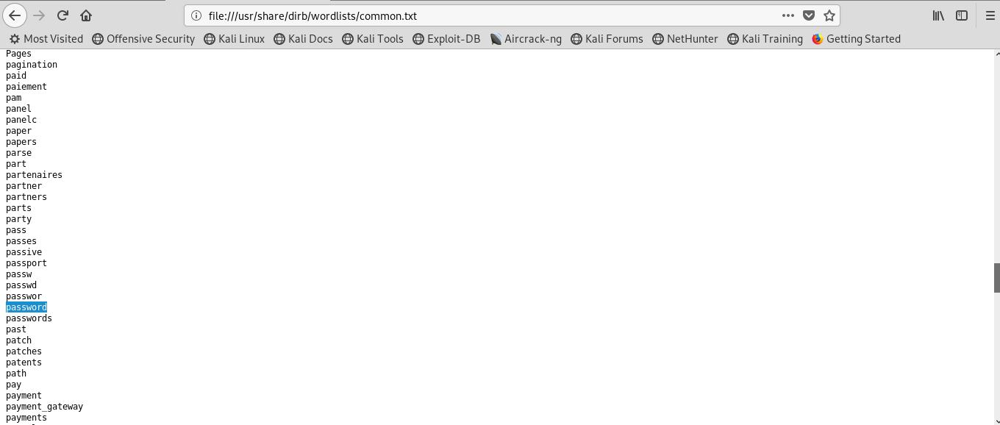

#  White Christmas
## Method: **Metasploit and Enumeration**
## Student Name: **Pramath Joshi**
## Instructors: **Mr Sayasmito and Mr David Jorm**
## Institution: **Coder Academy Melbourne**
## Aim: **To Escalate Privileges and Achieve ROOT Access**
## Exploit: **PHP Script**
## Status: **To Be COMPLETED**

# Background

No background information provided. 

# Methodology Step By Step:

1. Netdiscover is a tool in Linux that is used to find hosts on wireless or switched networks. ARP which stands for Address Resolution Protocol allows the discovery of hosts based on the MAC or the physical address of a system. The -r flag is commonly used in junction with netdiscover command itself and it filters down the search to be on specified networks.

 Along with netdiscover -r command there are other commands that do a full scan or other types of scans based on how many hosts are available. 

I approached the problem by doing a netdiscover -r for the range of networks available and I know that I am on the 192.168.211 network because I am on host mode, I know that 192.168.211.1 is the default gateway for the kali machine or the first usable address that has been assigned to Kali. 

I know that the vulnerable server’s address won’t be ending in a .254 as it’s the last usable address and is normally not used. I have one option left and that is the 192.168.211.134 Internet Protocol Address and I am confident that this address belongs to the White Christmas vulnerable server.

2. Firstly NMAP (Network Mapper) is a network scanning tool that and is a Linux Operating System command that scans the network for vulnerabilities on a system. It is used to identify what devices are currently running on systems and allows to identify hosts that are present and the services that they offer which include finding open ports and detecting security risks. 

There are different types of NMAP scans available for a penetration tester to use but the recommendation is to start from a light weight scan to a full deep scan if necessary.

Useful links: https://hackertarget.com/nmap-cheatsheet-a-quick-reference-guide/ 

I issued a lightweight Nmap scan of the 192.168.211.134 IP address to find out information regarding which ports are open in the network and what services they are providing. 

Normally TCP (Transmission Control Protocol) provides a web server service hence I can connect to that using port 80. I know that port 22 is used strictly by SSH and this is vulnerable because if I know the machine’s password, I can run SSH (Secure Shell) and the IP address command and I am able to easily login to the machine. 

3. I opened a browser in my Kali machine and entered the White Christmas machine’s Internet Protocol Address of 192.168.211.134 and I know that port 80 is offering a HTTP (Hyper Text Transfer Protocol) service that is a web server so I inserted the number 80 next to the IP address in the form of: http://192.168.211.134:80 and the browser took me to the above page called IT’s easy Fiduma egua!. 

I am guessing that it’s the same meaning in a different language and while observing the page content everything is unreadable. This is my first clue. I also believe that the image in the screenshot appears to be a photo of some kind, so I need to find out more information. 

4. I issued a DIRB command that allows me to find hidden directories or file systems in the vulnerable machine. DIRB is basically a web content scanner and works by launching a dictionary-based attack against a web server like White Christmas that is running on port 80 and providing an HTTP service and DIRB analyses the response.

 I got an error saying that there were too many errors connecting to host which I think means that it wasn’t successful because I have already connected many times. 

I copied the wordlist files listed in the screenshot: WORDLIST_FILES: /usr/share/dirb/wordlists/common.txt and pasted it into the browser on Kali.

I copied the wordlist files listed in the screenshot: WORDLIST_FILES: /usr/share/dirb/wordlists/common.txt and pasted it into the browser on Kali.

I realised that it contains a hidden text file called password or passwords and I can see many other directories that would be of good use. 

With Mr Sayas’s help I was able to figure out that this is not the wordlists that is on the target machine and the commons.txt is a word list that's on the Kali machine 7 and Dirb uses that to find directories. 

So, I was incorrect in my findings here and I will refine the search and try something else. 

5. I used the above URL that I had posted and did a Nmap -A 192.168.211.134 command which detects Operating System and Services the machine is running. 

I knew I had to find this information because if I can find which OS the machine runs on, I can gather more information or hints which I can use to crack the machine. 

 From the above image I know that it is giving me information about which port is open and more information about the version of the SSH which is 6.6.1. It is also giving me information about the ssh-hostkey which I need to find out about. 

 6. The image below is giving me information about the machine’s physical address and the most critical is that its displaying that the technology that the machine is running on is Linux 3.X by 4.X. 
 
 The screenshot also presents that the Operating System that its using is Linux 3.2 – 4.9 so I can use this information to find out more information about the machine. 
 
 The screenshot also gives me facts about the service that is Linux kernel.
 
 

 7. I wanted to see if there are any other ports that may give me other clues, so I did a Nmap scan for the top 10 ports that are commonly used and still found that only port 22 for SSH and port 80 are open. 

 

 8. I surprisingly discovered other ports which I never knew of by issuing the command Nmap -T5 192.168.211.0/24 which is an operation to quickly scan all devices and computers for open ports. 
 
 I can now find out more information about the services that is running on these ports because I do not know what msrpc, NetBIOS’s and Microsoft-ds is. 
 
 I know I cannot use these services to attack White Christmas because they are all running on the Operating System of Microsoft, but my target machine is running on Linux, so I cannot use this.

 

 

